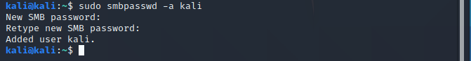
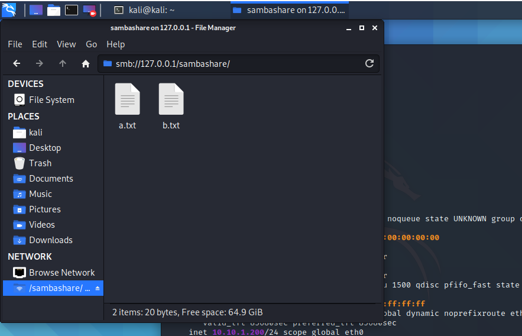

>---
> # **Practical 5**
> ##### Install Samba to share folder or files between Windows and Linux.
>---


> **Install the samba package**
```
sudo apt-get update
sudo apt-get install samba
```

> **Create a directory for it to share**
```
mkdir /home/kali/sambashare/
```

> **Created two files to test**


> **The configuration file. Have to add the directory we want to share.**
```
sudo nano /etc/samba/smb.conf
```

> **Add this to the end of the file.**
```
[sambashare]
    comment = Samba on Ubuntu
    path = /home/username/sambashare
    read only = no
    browsable = yes
```


> **Start/Restart the service**
```
sudo service smbd restart
```

> **Allow samba through the firewall**
```
sudo ufw allow samba
```


> **Setting up User Account**
```
sudo smbpasswd -a kali
```
_**Note:** Username must belong to a system account._



> **Open the file explorer, type  `smb://<ip-address>/<shared_file>`**
```
smb://127.0.0.1/sambashare
```


___